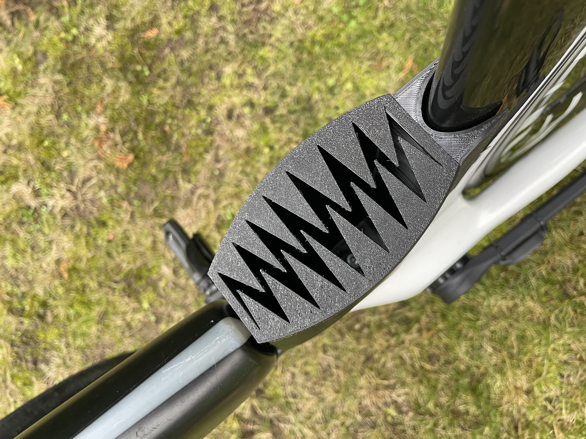

# Triathlon_bike_boxes 🚲
## Aerodynamic Boxes for Triathlon Bike - 3D printed

_This small side project was about creating aerodynamic storage for the Cervelo P3 Triathlon Bike. To 3d print these boxes I used PETG material due to its durability and strength. While creating these aerodynamic boxes I focused also on quick access to tools or essentials._

# Bottom section storage 

 

# Top and bottom section storage 

# Mounting point of bottom storage

# Bottom cover made out of TPU material

